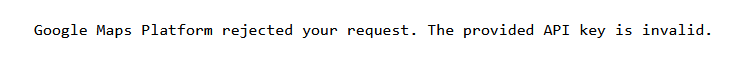
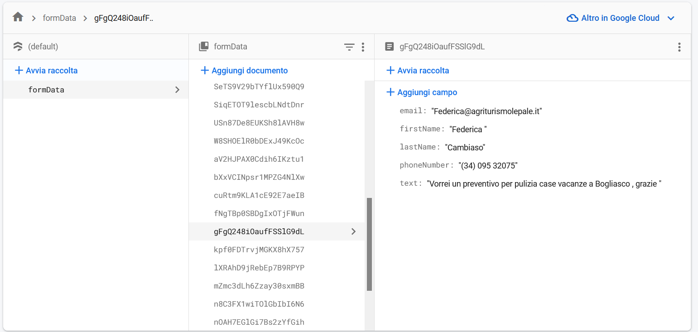

# EasySite - Template Vue.js

EasySite is a versatile Vue.js and Quasar template designed for creating sleek and intuitive facade websites. It's engineered for simplicity, making it effortless to customize and enhance according to your specific needs.

Watch [this site realized with this template](https://itlpuliziegenova.it)


[](https://clipchamp.com/watch/rGfTaHwric3)


## Table of Contents

- [EasySite - Template Vue.js](#easysite---template-vuejs)
  - [Table of Contents](#table-of-contents)
- [How to use this template?](#how-to-use-this-template)
  - [Ensure Node.js and Vue CLI are Installed:](#ensure-nodejs-and-vue-cli-are-installed)
      - [Quasar Framework](#quasar-framework)
  - [Clone This Repository:](#clone-this-repository)
  - [Navigate to the Project Directory:](#navigate-to-the-project-directory)
  - [Install Dependencies:](#install-dependencies)
  - [Run the Quasar Project:](#run-the-quasar-project)
    - [Make it Personal](#make-it-personal)
      - [Adapt Packages](#adapt-packages)
    - [Change API tokens \& Adapt Firebase Hosting and Services](#change-api-tokens--adapt-firebase-hosting-and-services)
      - [Adapt Firebase Configuration](#adapt-firebase-configuration)
      - [Adapt Google API's usage:](#adapt-google-apis-usage)
      - [Manage the Google Analytic TAG](#manage-the-google-analytic-tag)
  - [Build the app for production](#build-the-app-for-production)
  - [Use the Firestore Database](#use-the-firestore-database)
  - [Extras](#extras)
    - [Animations and Transitions](#animations-and-transitions)
- [Contributing](#contributing)
- [License](#license)

# How to use this template?

## Ensure Node.js and Vue CLI are Installed:

Make sure that you have **Node.js** installed. If not, you can download it from [nodejs.org](https://nodejs.org).

After installing Node.js, you can install Vue CLI globally using the following command:

```bash
npm install -g @vue/cli
```

#### Quasar Framework

Make sure you have Quasar CLI installed globally. If not, you can install it using npm:

```bash
npm install -g @quasar/cli
```

Refers always to the official documentation of quasar that you will find [in their official website](https://quasar.dev/docs).

## Clone This Repository:
Clone this repository to your local machine:
```bash
git clone https://github.com/PedemonteGiacomo/EasySite
```

## Navigate to the Project Directory:

Now you should navigate to the project directory:

```bash
cd EasySite
```

## Install Dependencies:

Inside the project directory, you should install project dependencies:

```bash
npm install
```

## Run the Quasar Project:

To run the Quasar project in development mode, as early suggested, users can use the following command:

```bash
quasar dev
```
This will start the development server, and quasar will automatically open the development server page.

### Make it Personal

#### Adapt Packages

To Adapt the site to your personal usage, go change inside the [package-lock.json](https://github.com/PedemonteGiacomo/EasySite/blob/main/package-lock.json#L1-L8) the names of the project:

```bash
  {
    "name": "quasar-itl", # Adapt this to you personal name
    "version": "0.0.1",
    "lockfileVersion": 3,
    "requires": true,
    "packages": {
      "": {
        "name": "quasar-itl", # Change package managing
        ...
        }
      ...
    }
  }
```

You need to do this also in the [package.json](https://github.com/PedemonteGiacomo/EasySite/blob/main/package.json#L1C1-L14C5) file in the following code:

```bash
  {
    "name": "quasar-itl",
    "version": "0.0.1",
    "description": "ITL impresa di pulizie web",
    "productName": "ITL app",
    "author": "Giacomo Pedemonte <giacomopedemonte@libero.it>",
    "private": true,
    "scripts": {
      "lint": "eslint --ext .js,.vue ./",
      "format": "prettier --write \"**/*.{js,vue,scss,html,md,json}\" --ignore-path .gitignore",
      "test": "echo \"No test specified\" && exit 0",
      "dev": "quasar dev",
      "build": "quasar build"
    },
    ...
  }
```

### Change API tokens & Adapt Firebase Hosting and Services
Since the template contains google maps API usage and Firebase configuration, if you want to use them you will need to configurate you project throught [Firebase](https://firebase.google.com/)

#### Adapt Firebase Configuration
Go to [Firebase](https://firebase.google.com/) official site and follow the instructions to create a new project and link this project to Firebase. I suggest to have a hosting based with Firebase that makes you obtain a development server that is reachable also for possible users.

Change the content of [/firebase/index.js](https://github.com/PedemonteGiacomo/EasySite/blob/main/src/firebase/index.js#L10) with the configuration provided in firebase after setting your project.

[/firebase/index.js](https://github.com/PedemonteGiacomo/EasySite/blob/main/src/firebase/index.js#L10)

Change the name of the project to your own that you configured in firebase in inside [firebaserc](https://github.com/PedemonteGiacomo/EasySite/blob/main/.firebaserc#L3)

#### Adapt Google API's usage:

In this template is used a Google Map template and requesting positions need a simple API key generated by Google. Follow the instruction at this [link to the official page](https://developers.google.com/maps/documentation/javascript/get-api-key?hl=it).

MapComponent contains google maps API usage so change it with your personal API_KEY obtained by Google. Otherwise, without specifing it, the result will be the following:



[Insert your google maps API in MapComponent.vue](https://github.com/PedemonteGiacomo/EasySite/blob/main/src/components/MapComponent.vue#L21) in the following code:

```bash
  <script>
  export default {
    props: {
      // You can pass the address as a prop to dynamically generate the map URL
      address: {
        type: String,
        required: true
      }
    },
    computed: {
      // Computed property to generate the dynamic map URL based on the passed address prop
      mapUrl() {
        const apiKey = 'YOUR_GOOGLE_API_KEY'; // Replace with your Google Maps API Key
        const formattedAddress = encodeURIComponent(this.address);
        return `https://www.google.com/maps/embed/v1/place?key=${apiKey}&q=${formattedAddress}`;
      }
    }
  };
  </script>
```

And then to utilize this component simply modify the string that refers to the place that want to visualize.

Example of usage in the [AboutUs.vue Page](https://github.com/PedemonteGiacomo/EasySite/blob/main/src/pages/AboutUsPage.vue#L152):

```bash
  <MapComponent address="ITL Srl IMPRESA PULIZIA, Genova Italy"/>
```

This by simply including the Map as a component in the following way:

```bash
  import AboutUsCarousel from 'src/components/AboutUsCarousel.vue';
  import { useQuasar } from 'quasar'
  import MapComponent from 'src/components/MapComponent.vue';

  export default {
    components: {
      AboutUsCarousel,
      MapComponent
    },
    ...
  }
```

This will make you obtain as result the following map rendering:


#### Manage the Google Analytic TAG
To generate a Google Analytic TAG there are two possible way:

- Go directly in the Firebase Console of your project and add to your project services the Google Analytic service. This will make you follow a procedure to get the G-TAG to insert it inside your site to analyze the accesses. [***SUGGESTED***]

- Go directly to the [Google Analytic web page](https://analytics.google.com/analytics/web/) and setup following the instruction provided inside the page.


When you have a Google Analytic TAG, go in the IndexPage. To make work properly the G-TAG, if you have enable it from firebase, you will have to change the "GOOGLE_ANALYTIC_TAG" with your own inside [IndexPage following lines](https://github.com/PedemonteGiacomo/EasySite/blob/main/src/pages/IndexPage.vue#L356):

```bash
  ...
  // JS tags
  script: {
    ldJson: {
      type: 'application/ld+json',
      innerHTML: `{ "@context": "http://schema.org" }`
    },
    // Add the Google Tag for Analytics script and tracking code provided by Firebase
    gtag: {
      src: 'https://www.googletagmanager.com/gtag/js?id=GOOGLE_ANALYTICS_TAG',
      async: true
    },
    gtagConfig: {
      content: `
        window.dataLayer = window.dataLayer || [];
        function gtag() {
          dataLayer.push(arguments);
        };
        gtag("js", new Date());
        gtag("config", "GOOGLE_ANALYTICS_TAG");
      `,
    },
    ...
  }
```
## Build the app for production

When the site is ready to be launched you will nomore need the development server that quasar provides you with ```quasar dev```, now you can simply type in the command prompt:

```bash
quasar build
```

This will make you "compile" your quasar project and setup the SPA (Single Page Application) that can be easily hosted on Firebase.

If you are hosting the site with Firebase then to make the changes be visible also in the deployment server (obtained by Firebase in the Firebase Hosting console web page related to you rproject connected to the site you are realizing) you need to perform the following command:

```bash
firebase deploy
```

## Use the Firestore Database

To make available the form usage by the user and your visualization you will need to insert also Firestore Database connection directly in the Firebase console (as done for the hosting and/or for the analytics).


When setting up the Firestore database make sure to modify the content of [firestore.rules](https://github.com/PedemonteGiacomo/EasySite/blob/main/firestore.rules#L1-L9) that reflects the rules that you can find in the Firebase Firestore dashboard. In the following we are assuming that all the users can read and write in the db to make people add without auth. permissions to obtain all the appointments requests without limitation.

```bash
  rules_version = '2';

  service cloud.firestore {
    match /databases/{database}/documents {
      match /{document=**} {
        allow read, write: if true;
      }
    }
  }
```

So, the Firestore database is used to store the mails recieved by the users that compile the contact form inside almost all the pages.

You can then manage the requests recieved directly inside your console in Firebase.



## Extras
### Animations and Transitions

Since there is a mess performing good animation in quasar in this site there are intersections to resume the user attention and make it more interactive with the pages.
Play as you like with those to obtain the desired effect.

Animation are based on [animation.style](https://animate.style/).

# Contributing

Contributions are welcome!

# License
This project is licensed under the MIT License.

<!-- Acknowledgements

    Mention any libraries, tools, or people you'd like to thank or acknowledge. -->
