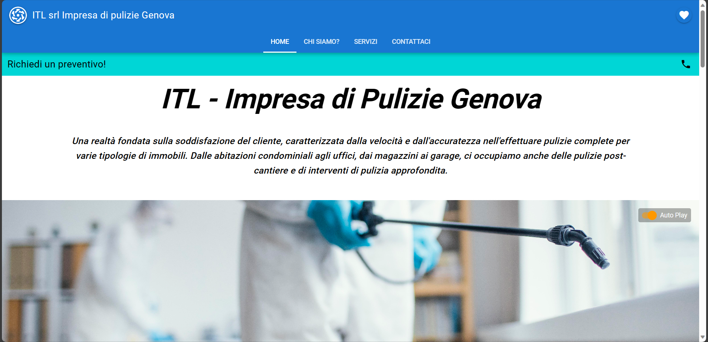

# EasySite - Template Vue.js

EasySite is a versatile Vue.js and Quasar template designed for creating sleek and intuitive facade websites. It's engineered for simplicity, making it effortless to customize and enhance according to your specific needs.

Watch [this site realized with this template](https://itlpuliziegenova.it)


[](https://clipchamp.com/watch/rGfTaHwric3)


## Table of Contents

- [EasySite - Template Vue.js](#easysite---template-vuejs)
  - [Table of Contents](#table-of-contents)
- [Requisites](#requisites)
  - [Ensure Node.js and Vue CLI are Installed:](#ensure-nodejs-and-vue-cli-are-installed)
  - [Quasar Framework](#quasar-framework)
- [How to use this Template?](#how-to-use-this-template)
  - [Clone this Repository:](#clone-this-repository)
  - [Navigate to the Project Directory:](#navigate-to-the-project-directory)
  - [Install Dependencies:](#install-dependencies)
    - [Install Function Dependencies](#install-function-dependencies)
      - [Navigate inside functions folder](#navigate-inside-functions-folder)
      - [Install functions dependencies](#install-functions-dependencies)
      - [Navigate back to the EasySite folder](#navigate-back-to-the-easysite-folder)
  - [Run the Quasar Project:](#run-the-quasar-project)
- [Make it Personal](#make-it-personal)
  - [Adapt Packages \& Configuration with your Project Name](#adapt-packages--configuration-with-your-project-name)
    - [Configuration](#configuration)
    - [Pakages](#pakages)
  - [Adapt Firebase Configuration](#adapt-firebase-configuration)
    - [Use the Firestore Database](#use-the-firestore-database)
    - [Adapt Google API's usage:](#adapt-google-apis-usage)
    - [Manage the Google Analytic TAG](#manage-the-google-analytic-tag)
    - [Use SendGrid API to trigger mail when user complete contact form](#use-sendgrid-api-to-trigger-mail-when-user-complete-contact-form)
  - [Build the app for production](#build-the-app-for-production)
  - [Extras](#extras)
    - [Animations and Transitions](#animations-and-transitions)
- [Contributing](#contributing)
- [License](#license)

# Requisites

## Ensure Node.js and Vue CLI are Installed:

Make sure that you have **Node.js** installed. If not, you can download it from [nodejs.org](https://nodejs.org).

After installing Node.js, you can install Vue CLI globally using the following command:

```bash
npm install -g @vue/cli
```

## Quasar Framework

Make sure you have Quasar CLI installed globally. If not, you can install it using npm:

```bash
npm install -g @quasar/cli
```

Refers always to the official documentation of quasar that you will find [in their official website](https://quasar.dev/docs).

# How to use this Template?

## Clone this Repository:
Clone this repository to your local machine:
```bash
git clone https://github.com/PedemonteGiacomo/EasySite
```

## Navigate to the Project Directory:

Now you should navigate to the project directory:

```bash
cd EasySite
```

## Install Dependencies:

Inside the project directory, you should install project dependencies:

```bash
npm install
```

### Install Function Dependencies

Since we are using Firebase I've created a personal usage of the SendGrid Trigger being a sinple function calling via API hosted by Firebase functions.
When you run ```firebase deploy``` will instantiate those functions declared in the [function/index.js](https://github.com/PedemonteGiacomo/EasySite/blob/main/functions/index.js):

#### Navigate inside functions folder
```bash
cd functions
```

#### Install functions dependencies
```bash
npm install
```

#### Navigate back to the EasySite folder
```bash
cd ..
```

## Run the Quasar Project:

To run the Quasar project in development mode, as early suggested, users can use the following command:

```bash
quasar dev
```
This will start the development server, and quasar will automatically open the development server page.

# Make it Personal

## Adapt Packages & Configuration with your Project Name
### Configuration

Explore the [config](https://github.com/PedemonteGiacomo/EasySite/blob/main/quasar.config.js#L189) file to adapt to fit your needs.

For the moment  I sugegst only to change the project name to your personal one:
```js
builder: {
    // https://www.electron.build/configuration/configuration
    appId: "quasar-itl", //change with your personal appID
},
```

### Pakages
To Adapt the site to your personal usage, go change inside the [package-lock.json](https://github.com/PedemonteGiacomo/EasySite/blob/main/package-lock.json#L1-L8) the names of the project:

```js
{
  "name": "quasar-itl", // Adapt this to you personal name
  "version": "0.0.1",
  "lockfileVersion": 3,
  "requires": true,
  "packages": {
    "": {
      "name": "quasar-itl", // Change package managing
      ...
      }
    ...
  }
}
```

You need to do this also in the [package.json](https://github.com/PedemonteGiacomo/EasySite/blob/main/package.json#L1C1-L14C5) file in the following code:

```js
{
  "name": "quasar-itl",
  "version": "0.0.1",
  "description": "ITL impresa di pulizie web",
  "productName": "ITL app",
  "author": "Giacomo Pedemonte <giacomopedemonte@libero.it>",
  "private": true,
  "scripts": {
    "lint": "eslint --ext .js,.vue ./",
    "format": "prettier --write \"**/*.{js,vue,scss,html,md,json}\"--ignore-path .gitignore",
    "test": "echo \"No test specified\" && exit 0",
    "dev": "quasar dev",
    "build": "quasar build"
  },
  ...
}
```

## Adapt Firebase Configuration
Go to [Firebase](https://firebase.google.com/) official site and follow the instructions to create a new project and link this project to Firebase. I suggest to have a hosting based with Firebase that makes you obtain a development server that is reachable also for possible users.

Change the content of [/firebase/index.js](https://github.com/PedemonteGiacomo/EasySite/blob/main/src/firebase/index.js#L10-L20) with the configuration provided in firebase after setting your project.

```js
// Your web app's Firebase configuration:
//  - follow firebase documentation when you setup your firebase project
// For Firebase JS SDK v7.20.0 and later, measurementId is optional
const firebaseConfig = {
  apiKey: ..., // this is the key relevant to your project
  authDomain: ..., // relevant to your application of your project
  databaseURL: ..., // firebase db url (depends on Timezones)
  projectId: ..., // project ID
  storageBucket: ..., // bucket of your application
  messagingSenderId: ...,
  appId: ...,
  measurementId: ..., // google analytics tag [if needed]
};
```

Change the name of the project to your own that you configured in firebase in inside [firebaserc](https://github.com/PedemonteGiacomo/EasySite/blob/main/.firebaserc#L1-L5):

```js
{
  "projects": {
    "default": "PUT_YOUR_PROJECT_NAME_THAT_APPEARS_ON_FIREBASE"
  }
}
```

### Use the Firestore Database

To make available the form usage by the user and your visualization you will need to insert also Firestore Database connection directly in the Firebase console (as done for the hosting and/or for the analytics).

When setting up the Firestore database make sure to modify the content of [firestore.rules](https://github.com/PedemonteGiacomo/EasySite/blob/main/firestore.rules#L1-L9) that reflects the rules that you can find in the Firebase Firestore dashboard. In the following we are assuming that all the users can read and write in the db to make people add without auth. permissions to obtain all the appointments requests without limitation.

```rules
rules_version = '2';

service cloud.firestore {
  match /databases/{database}/documents {
    match /{document=**} {
      allow read, write: if true;
    }
  }
}
```

So, the Firestore database is used to store the mails recieved by the users that compile the contact form inside almost all the pages.

So the declaration of the database is made once and is in [firebase/index.js](https://github.com/PedemonteGiacomo/EasySite/blob/main/src/firebase/index.js):

```js
// Initialize Firebase
firebase.initializeApp(firebaseConfig);
const analytics = firebase.analytics();

analytics.setAnalyticsCollectionEnabled; // set the analytics collection on that tag
//(don't deserve google tag manager if you copy the ga(google-analytics) tag that firebase provide you directly from the dashboard of your project)

// Initialize Cloud Firestore and get a reference to the service
const db = firebase.firestore();

export { db }; // extract the db to easily recover it
```

In this template site, we use the DB to store the mail received by users in one place with easy access. So, this db is used in the [catchingClientComponent](https://github.com/PedemonteGiacomo/EasySite/blob/main/src/components/CatchingClientComponent.vue#L37), more precisely in [this part](https://github.com/PedemonteGiacomo/EasySite/blob/main/src/components/CatchingClientComponent.vue#L55-L69) of the code:

```js
// Your form data
const formData = {
  firstName: firstName.value,
  lastName: lastName.value,
  email: email.value,
  phoneNumber: phoneNumber.value,
  text: text.value,
};
// Add a new document with a generated id to store the message on firestore
var newMexRef = db.collection("formData").doc
newMexRef.set(formData)
console.log("Document written with ID: ", newMexRef.id);
```

You can then manage the requests recieved directly inside your console in Firebase.


### Adapt Google API's usage:

In this template is used a Google Map template and requesting positions need a simple API key generated by Google. Follow the instruction at this [link to the official page](https://developers.google.com/maps/documentation/javascript/get-api-key?hl=it).

MapComponent contains google maps API usage so change it with your personal API_KEY obtained by Google. Otherwise, without specifing it, the result will be the following:


[Insert your google maps API in MapComponent.vue](https://github.com/PedemonteGiacomo/EasySite/blob/main/src/components/MapComponent.vue#L21) in the following code:

```js
<script>
export default {
  props: {
    // You can pass the address as a prop to dynamically generatethe map URL
    address: {
      type: String,
      required: true
    }
  },
  computed: {
    // Computed property to generate the dynamic map URL based onthe passed address prop
    mapUrl() {
      const apiKey = 'YOUR_GOOGLE_API_KEY'; // Replace with yourGoogle Maps API Key
      const formattedAddress = encodeURIComponent(this.address);
      return `https://www.google.com/maps/embed/v1/place?key={apiKey}&q=${formattedAddress}`;
    }
  }
};
</script>
```

And then to utilize this component simply modify the string that refers to the place that want to visualize.

Example of usage in the [AboutUs.vue Page](https://github.com/PedemonteGiacomo/EasySite/blob/main/src/pages/AboutUsPage.vue#L152):

```js
<MapComponent address="ITL Srl IMPRESA PULIZIA, Genova Italy"/>
```

This by simply including the Map as a component in the following way:

```js
import AboutUsCarousel from 'src/components/AboutUsCarousel.vue';
import { useQuasar } from 'quasar'
import MapComponent from 'src/components/MapComponent.vue';

export default {
  components: {
    AboutUsCarousel,
    MapComponent
  },
  ...
}
```

This will make you obtain as result the following map rendering:


### Manage the Google Analytic TAG
To generate a Google Analytic TAG there are two possible way:

- Go directly in the Firebase Console of your project and add to your project services the Google Analytic service. This will make you follow a procedure to get the G-TAG to insert it inside your site to analyze the accesses. [***SUGGESTED***]

- Go directly to the [Google Analytic web page](https://analytics.google.com/analytics/web/) and setup following the instruction provided inside the page.


When you have a Google Analytic TAG, go in the IndexPage. To make work properly the G-TAG, if you have enable it from firebase, you will have to change the "GOOGLE_ANALYTIC_TAG" with your own inside [IndexPage following lines](https://github.com/PedemonteGiacomo/EasySite/blob/main/src/pages/IndexPage.vue#L356):

```js
...
// JS tags
script: {
  ldJson: {
    type: 'application/ld+json',
    innerHTML: `{ "@context": "http://schema.org" }`
  },
  // Add the Google Tag for Analytics script and tracking codeprovided by Firebase
  gtag: {
    src: 'https://www.googletagmanager.com/gtag/jsid=GOOGLE_ANALYTICS_TAG',
    async: true
  },
  gtagConfig: {
    content: `
      window.dataLayer = window.dataLayer || [];
      function gtag() {
        dataLayer.push(arguments);
      };
      gtag("js", new Date());
      gtag("config", "GOOGLE_ANALYTICS_TAG");
    `,
  },
  ...
}
```

### Use SendGrid API to trigger mail when user complete contact form

In the template there is a simple contact form that can be used by the user and make the owner of the site receive the content of the message sent by the user.

The mail trigger is handled by [Sendgrid](https://app.sendgrid.com/) so follow the instrctions in the guide to get the API KEY to send mails automatically and put you API KEY directly [here](https://github.com/PedemonteGiacomo/EasySite/blob/main/functions/index.js#L15) or in your env.

```js
// Initialize SendGrid API key
sgMail.setApiKey("YOUR_SENDGRID_API_KEY");
```

Then you will change all the configuration of your response email in the following code (sendgrid will provide you all the code):

``` js
exports.SendMail = functions.https.onRequest((request, response) => {
  cors(request, response, () => {
    // Your function logic here
// Send email to user
    const userMsg = {
      to: email, // Email of the user obtained by the contact form
      from: "giacomopedemonte@libero.it", // Replace with your verified sender email
      templateId: "d-c4825a7d9322498ebc92c784d0e5ff62", // Replace with your SendGrid template ID
      asm: {
        groupId: "YOUR_UNSUBSCRIBE_GROUP_ID" // Replace YOUR_UNSUBSCRIBE_GROUP_ID with the actual ID of your unsubscribe group
      },
      ...
    };
  })
  }
)
```

This function will be deployed and hosted by Firebase and you can access and check the state of this function in the panel in the Firebase console.

You will obtain your personal function link by performing the command:

```bash
firebase deploy --only functions
```

Once you have obtained you Function URL, you need to replace inside [CatchingClientComponent](https://github.com/PedemonteGiacomo/EasySite/blob/main/src/components/CatchingClientComponent.vue#L72) the *function URL* with your own and use it as an API, VERY COOL!

```js
// Make a POST request to your Firebase Function endpoint
await axios.post(
  // this url needs to be replaced
  'https://us-central1-itl-impresadipulizie-genova.cloudfunctions.net/SendMail',
  formData);
```

This also will bypass all possible Cross-Origin error because all the mail requests performed to the SendGrid API pass throught the same address which is your *function URL*.


As result, this system can make you obtain a template mail like the following:


And the owner, on the other hand, will receive a simple content-based email with a simple visualization of the message of the user.


## Build the app for production

When the site is ready to be launched you will nomore need the development server that quasar provides you with ```quasar dev```, now you can simply type in the command prompt:

```bash
quasar build
```

This will make you "compile" your quasar project and setup the SPA (Single Page Application) that can be easily hosted on Firebase.

If you are hosting the site with Firebase then to make the changes be visible also in the deployment server (obtained by Firebase in the Firebase Hosting console web page related to you rproject connected to the site you are realizing) you need to perform the following command:

```bash
firebase deploy
```

If your ```firebase deploy``` isn't working try to check if all the API are set. Another possible problem could be the URL of the function that is not defined for you and if you don't already changed it will be a problem [(check this)](#use-sendgrid-api-to-trigger-mail-when-user-complete-contact-form).

If more problem are discovered, please, contact me directly by mail at giacomopedemonte@libero.it.

The site should run even without all the API KEY updated.

## Extras
### Animations and Transitions

Since there is a mess performing good animation in quasar in this site there are intersections to resume the user attention and make it more interactive with the pages.
Play as you like with those to obtain the desired effect.

Animation are based on [animation.style](https://animate.style/).

[Animations](https://quasar.dev/options/animations)  in quasar are triggered by [Transitions](https://quasar.dev/options/transitions) that are managed by [Intersection](https://quasar.dev/vue-components/intersection) within the page. Some transitions and intersections are leaved in the comments almost in all the part of the code to obtain a more easy customization of animations and intersection. This because the several screen resolutions, animation can create some rendering problems.

 If interested follow [quasar docs](https://quasar.dev/options/transitions) to know more about animation, transitions and intersections.

# Contributing

Contributions are welcome!

# License
This project is licensed under the MIT License.

<!-- Acknowledgements

    Mention any libraries, tools, or people you'd like to thank or acknowledge. -->
