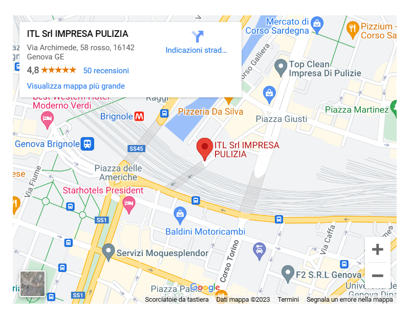

# EasySite - Template Vue.js

EasySite is a versatile Vue.js and Quasar template designed for creating sleek and intuitive facade websites. It's engineered for simplicity, making it effortless to customize and enhance according to your specific needs.

Watch [this site realized with this template](https://itlpuliziegenova.it)


[](https://clipchamp.com/watch/rGfTaHwric3)


## Table of Contents

- [EasySite - Template Vue.js](#easysite---template-vuejs)
  - [Table of Contents](#table-of-contents)
- [How to use this template?](#how-to-use-this-template)
  - [Ensure Node.js and Vue CLI are Installed:](#ensure-nodejs-and-vue-cli-are-installed)
      - [Quasar Framework](#quasar-framework)
  - [Clone This Repository:](#clone-this-repository)
  - [Navigate to the Project Directory:](#navigate-to-the-project-directory)
  - [Install Dependencies:](#install-dependencies)
  - [Run the Quasar Project:](#run-the-quasar-project)
    - [Change API tokens](#change-api-tokens)
      - [Adapt Firebase Configuration](#adapt-firebase-configuration)
      - [Adapt Google API's usage:](#adapt-google-apis-usage)
  - [Build the app for production](#build-the-app-for-production)
  - [Extras](#extras)
    - [Animations and Transitions](#animations-and-transitions)
- [Contributing](#contributing)
- [License](#license)

# How to use this template?

## Ensure Node.js and Vue CLI are Installed:

Make sure that you have [Node.js](https://nodejs.org) installed. If not, you can download it from nodejs.org.
After installing Node.js, you can install Vue CLI globally using the following command:

#### Quasar Framework

Make sure you have Quasar CLI installed globally. If not, you can install it using npm:

```bash
npm install -g @quasar/cli
```

## Clone This Repository:
Clone this repository to your local machine:
```bash
git clone https://github.com/PedemonteGiacomo/EasySite
```

## Navigate to the Project Directory:

Now you should navigate to the project directory:

```bash
cd EasySite
```

## Install Dependencies:

Inside the project directory, you should install project dependencies:

```bash
npm install
```

## Run the Quasar Project:

To run the Quasar project in development mode, as early suggested, users can use the following command:

```bash
quasar dev
```
This will start the development server, and quasar will automatically open the development server page.

### Change API tokens
Since the template contains google maps API usage and Firebase configuration, if you want to use them you will need to configurate you project throught [Firebase](https://firebase.google.com/)

#### Adapt Firebase Configuration
Change the content of this file with the configuration provided in firebase after setting your project.

[/firebase/index.js](https://github.com/PedemonteGiacomo/EasySite/blob/main/src/firebase/index.js#L10)

#### Adapt Google API's usage:

MapComponent contains google maps API usage so change when is mentioned:

At first start the result will be the following:


[Link to google maps API usage in MapComponent.vue](https://github.com/PedemonteGiacomo/EasySite/blob/main/src/components/MapComponent.vue#L21)

```bash
  <script>
  export default {
    props: {
      // You can pass the address as a prop to dynamically generate the map URL
      address: {
        type: String,
        required: true
      }
    },
    computed: {
      // Computed property to generate the dynamic map URL based on the passed address prop
      mapUrl() {
        const apiKey = 'YOUR_GOOGLE_API_KEY'; // Replace with your Google Maps API Key
        const formattedAddress = encodeURIComponent(this.address);
        return `https://www.google.com/maps/embed/v1/place?key=${apiKey}&q=${formattedAddress}`;
      }
    }
  };
  </script>
```

And then simply modify the string that refers to the place that want to visualize.

Example of usage in the [AboutUs.vue Page](https://github.com/PedemonteGiacomo/EasySite/blob/main/src/pages/AboutUsPage.vue#L152):

```bash
  <MapComponent address="ITL Srl IMPRESA PULIZIA, Genova Italy"/>
```

This by simply including the Map as a component in the following way:

```bash
  import AboutUsCarousel from 'src/components/AboutUsCarousel.vue';
  import { useQuasar } from 'quasar'
  import MapComponent from 'src/components/MapComponent.vue';

  export default {
    components: {
      AboutUsCarousel,
      MapComponent
    },
    ...
  }
```

This will make you obtain as result the following map rendering:



Always in the IndexPage, to make work properly the Google analytics tag, if you have enable it from firebase, you will have to change the "GOOGLE_ANALYTIC_TAG" with your own inside [IndexPage following lines](https://github.com/PedemonteGiacomo/EasySite/blob/main/src/pages/IndexPage.vue#L356):
```bash
  // JS tags
  script: {
    ldJson: {
      type: 'application/ld+json',
      innerHTML: `{ "@context": "http://schema.org" }`
    },
    // Add the Google Tag for Analytics script and tracking code provided by Firebase
    gtag: {
      src: 'https://www.googletagmanager.com/gtag/js?id=GOOGLE_ANALYTICS_TAG',
      async: true
    },
    gtagConfig: {
      content: `
        window.dataLayer = window.dataLayer || [];
        function gtag() {
          dataLayer.push(arguments);
        };
        gtag("js", new Date());
        gtag("config", "GOOGLE_ANALYTICS_TAG");
      `,
    },
```
## Build the app for production
```bash
quasar build
```

After duing the build, if you want to host with Firebase (suggested since all the services used here are from Firebase and is it free until the site is really used by users : usage-pay),
I suggest to setup the site as SPA(SinglePageApplication) to easily manage ga(google-analytics) tag and other features from Firebase.

This is not the best choice if you deserve to analyze the access on different pages but for a first impact site can be useful to have the site as a single-page application.

```bash
firebase deploy
```

If setting up the Firestore database make sure to modify the content of "firestore.rules" that reflects the rules that you can find in the Firebase Firestore dashboard.

## Extras
### Animations and Transitions

Since there is a mess performing good animation in quasar in this site there are intersections to resume the user attention and make it more interactive with the pages.
Play as you like with those to obtain the desired effect.

# Contributing

Contributions are welcome! See the Contributing Guidelines for more details.

# License
This project is licensed under the MIT License.

<!-- Acknowledgements

    Mention any libraries, tools, or people you'd like to thank or acknowledge. -->
